# 蒙特卡洛路径追踪软渲染器开发

此渲染器是学习性质，为了适应不同平台，减少繁琐的环境配置以及保证学习性，本渲染器由纯C++开发，使用自制数据结构CPU计算渲染，（纹理读取使用的`openCV`）

演示视频：

https://www.bilibili.com/video/BV1D5NNeiE5G/?spm_id_from=333.1387.homepage.video_card.click

### 10

- 实现基础路径追踪渲染管线，暂未实现MVP变换部分，目前是移动相机和静态场景
- 1.Diffuse材质，均匀将光线反射至上半球面；适配平面，球体，和OBJ模型以及OBJ场景
- 2.微表面材质 ，根据材质的折射率和粗糙度决定BRDF的值；适配平面，球体，和OBJ模型以及OBJ场景
- 3.全镜面反射材质，在一个平面下根据法线计算反射方向，实现渲染镜面材质；适配平面，球体，和OBJ模型以及OBJ场景
- 4.折射透射材质，适配平面，球体，和OBJ模型
- 5.Diffuse_Specular材质
- 实现球体，平面 ，面光源，并且支持以上材质，

### 11

- 基于BVH加速树结构和AABB包围盒，将三角形和网格划分成树形，查找时减少求交点遍历三角形或物体`Mesh`的个数

### 12

- 实现基于`thread`和`mutex`的多线程加速，进一步加速`cpu`渲染

release模式：

1.    BVH+多线程   200*1spp ： 110ms
2.    BVH+单线程   200*1spp ： 450ms
3.    遍历+多线程   200*1spp ： 100ms
4.    遍历+单线程   200*1spp ： 350ms

- 实现三角形`Triangle`类

#### 1.13

- 实现`MeshTriangle` 结合`Triangle`和 `OBJ_Loader`实现导入任意OBJ格式模型
- 适配了OBJ格式模型的diffuse ，反射 ，微表面材质

#### 1.14

- 实现**平滑着色** ，通过对三角顶点的法线做线性插值，实现了任意**平滑OBJ物体**的平滑着色和垂直着色的切换

| 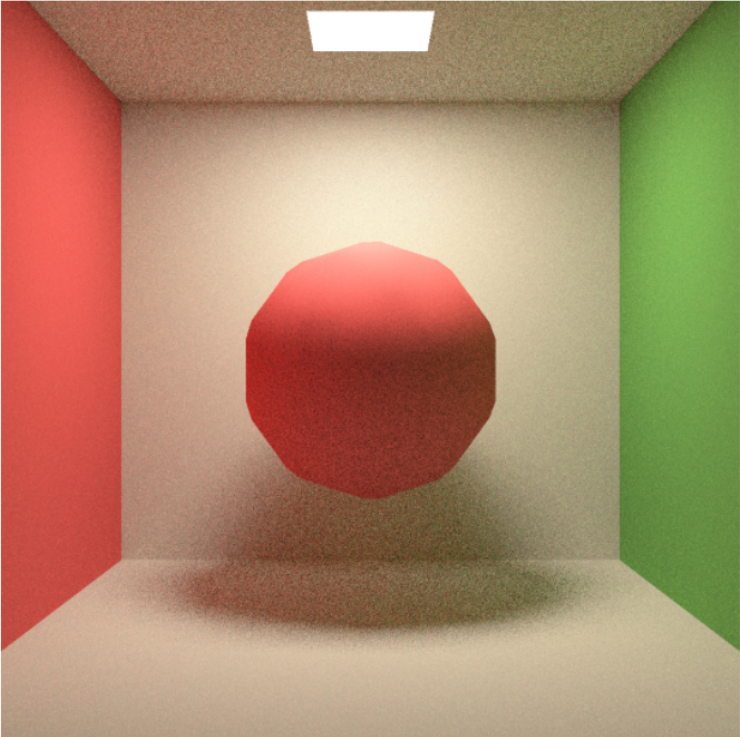 | 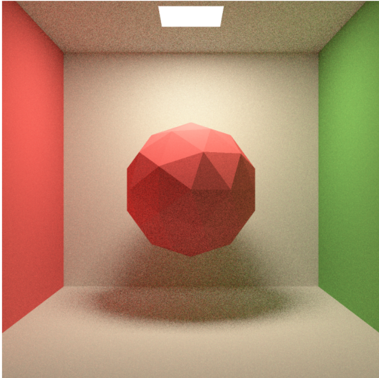 |
| ------------------------------------------------------------ | ------------------------------------------------------------ |
| 法线差值 - diffuse材质-spp5                                  | 非法线差值 - diffuse材质-spp5                                |
| 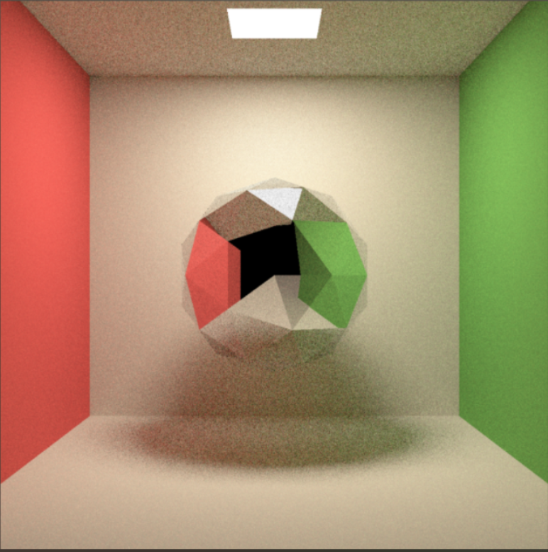 | 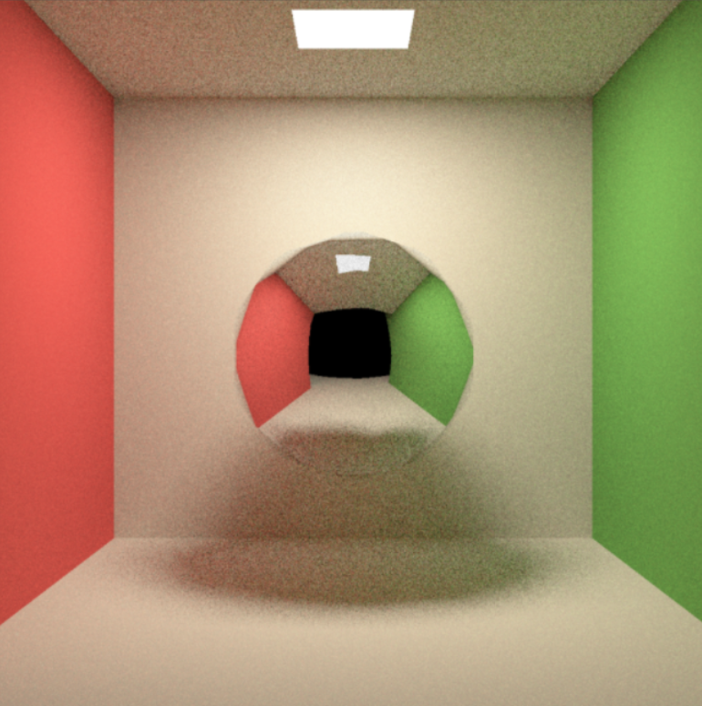 |
| 非法线差值-镜面材质-spp5                                     | 法线差值-镜面材质-spp5                                       |
| 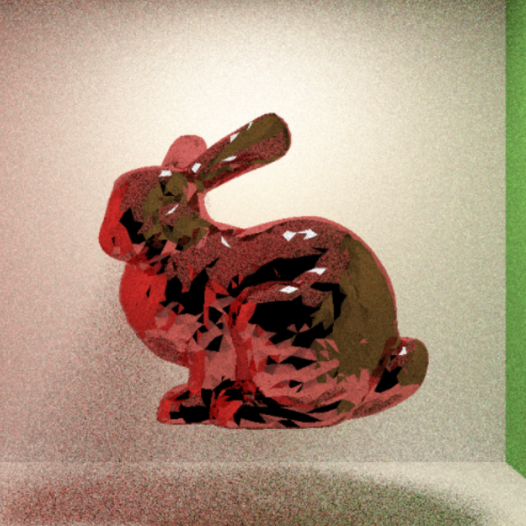 | 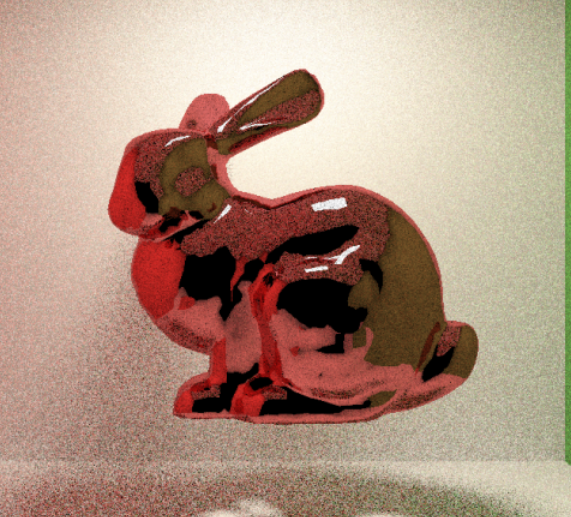 |
| 非法线差值的兔子                                             | 法线差值的兔子                                               |

#### 1.15

- 修正`Boll 和 Mesh 和 Plane`的双面法线问题，实现Mesh的透射和平滑透射

| 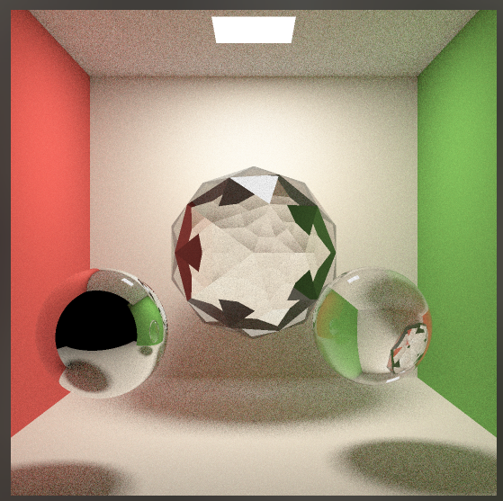 | 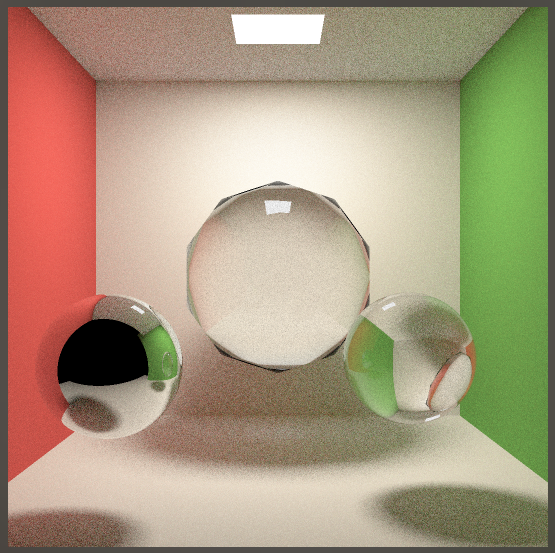 | 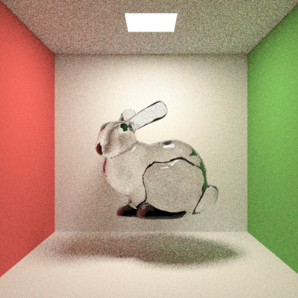 |
| ------------------------------------------------------------ | ------------------------------------------------------------ | ------------------------------------------------------------ |
| OBJ棱球，垂直着色透射 ior = 1.9                              | OBJ棱球，平滑着色透射  ior = 1.9                             | 平滑着色透射的兔子  ior = 1.3                                |

#### 1.17

**材质加载方式新增**

更新了Mesh模型的材质加载的两种方式

1. 初始化Mesh时直接指定材质种类
2. 初始化Mesh时不指定材质种类，而是根据MTL文件的参数决定着色方式

**实现读取MTL材质**

实现原理化BSDF到MTL材质参数的初步确定，着色方式如下：

- 基础色：漫反射颜色，Kd的值
- 糙度变大：高光强度不变 ，是光的集中程度变小
- 金属度变小：高光集中程度不变，但是高光变淡
- 折射率：结果就是Ni的值
- illum ：如果这个是illum 2为漫反射，illum 3为 diffuse-specular 材质， 他们之间的比例由Ns决定

#### 1.18

**实现使用diffuse-specular材质近似MTL材质**

重构了`MeshTriangle   Material     `和 `Scene::PathTracing`使用diffuse和reflect材质结合实现diffuse-specular材质来近似OBJ模型自带的材质

| 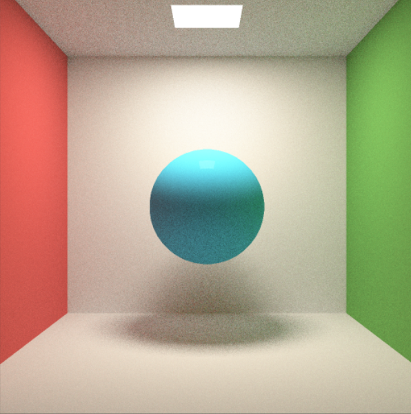 | 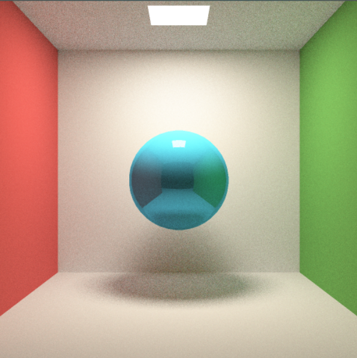 | 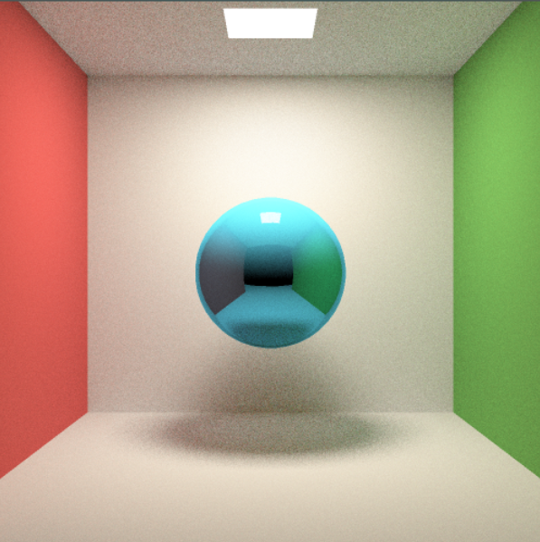 |
| ------------------------------------------------------------ | ------------------------------------------------------------ | ------------------------------------------------------------ |
| diffuse-specular光滑度0.1                                    | diffuse-specular光滑度0.5                                    | diffuse-specular光滑度0.8                                    |

**实现随机采样抗锯齿**

每一个像素多重采样时，相机射出去的光线在方向上都给一个小的偏移，最后所有spp采样的结果取平均估值实现反走样的效果

| 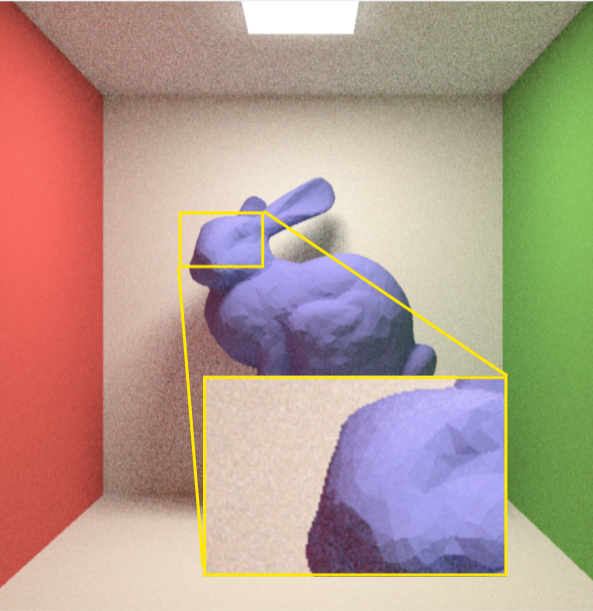 | >    | 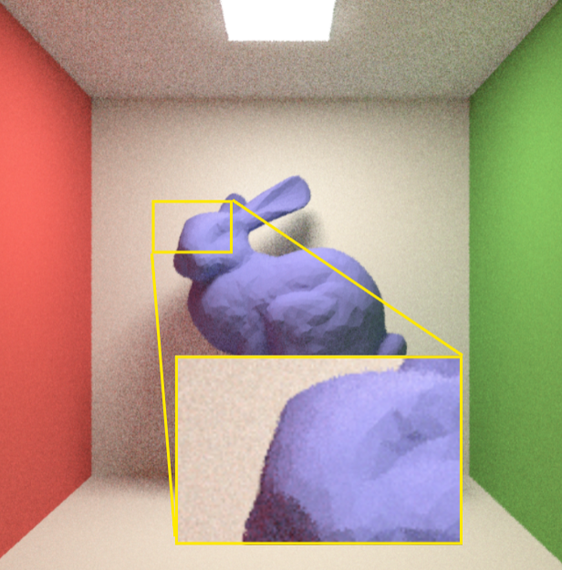 |
| ------------------------------------------------------------ | ---- | ------------------------------------------------------------ |
| 无SAA锯齿                                                    | >    | SAA反走样                                                    |

**实现UV映射纹理**

重构了Scene ， Material ， Object

根据三角形的顶点的UV坐标差值得出击中点的`uv`坐标，通过`openCV`读取图片对应像素颜色，实现纹理映射

| 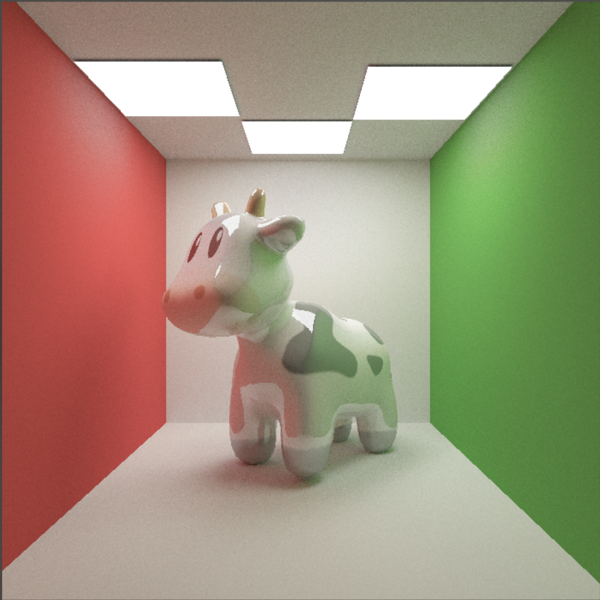 | 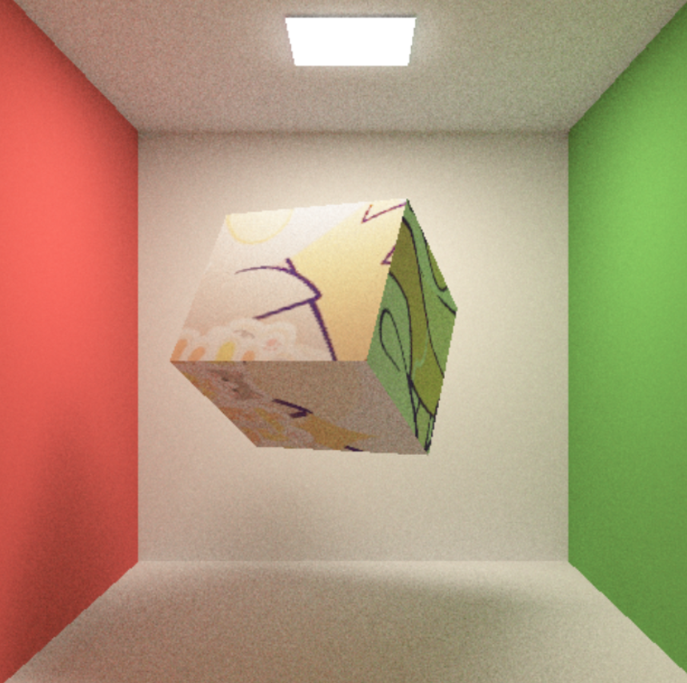 |
| ------------------------------------------------------------ | ------------------------------------------------------------ |
| UV纹理下的光滑奶牛 - `spp` -200                              | UV纹理下的Box -` spp` - 60                                   |

#### 2.9 

对`Object,MeshTraingle,BVHStruct , main ` 进行修改，修复了内存泄露问题