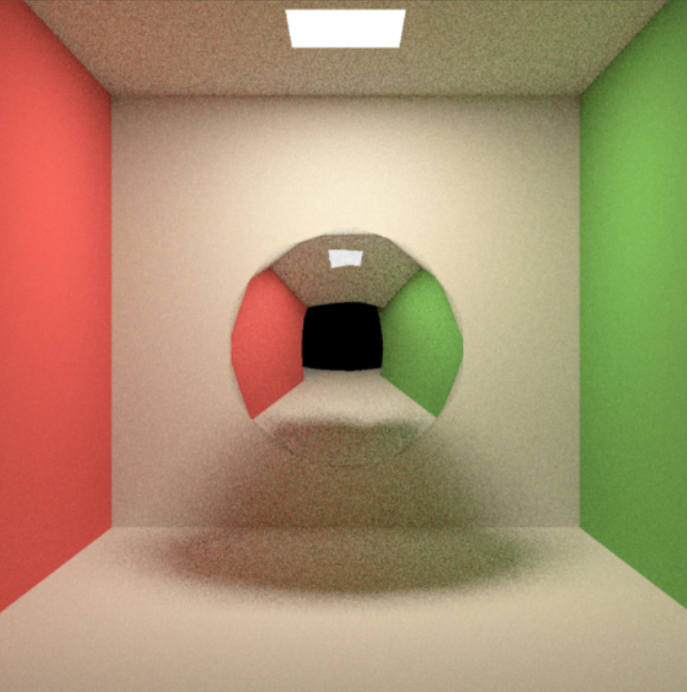

# 蒙特卡洛路径追踪软渲染器开发日志

### 2024年10月

- 实现基础路径追踪渲染管线，暂未实现MVP变换部分，目前是固定相机和静态场景

- Diffuse材质，均匀将光线反射至上半球面；适配平面，球体，和OBJ模型以及OBJ场景
- 2.微表面材质 ，根据材质的折射率和粗糙度决定BRDF的值；适配平面，球体，和OBJ模型以及OBJ场景
- 3.全镜面反射材质，在一个平面下根据法线计算反射方向，实现渲染镜面材质；适配平面，球体，和OBJ模型以及OBJ场景
- 4.折射透射材质，适配平面，球体，和OBJ模型
- 实现球体，平面 ，面光源，并且支持以上材质，

### 2024年11月

- 基于BVH加速树结构和AABB包围盒，将三角形和网格划分成树形，查找时减少求交点遍历三角形或物体`Mesh`的个数

### 2024年12月

- 实现基于`thread`和`mutex`的多线程加速，进一步加速`cpu`渲染

release模式：

1.    BVH+多线程   200*1spp ： 110ms
2.    BVH+单线程   200*1spp ： 450ms
3.    遍历+多线程   200*1spp ： 100ms
4.    遍历+单线程   200*1spp ： 350ms
5.    BVH+多线程   200***32s**pp ： 2600ms
6.    NO+多线程   200***32s**pp ： 2600ms

- 实现三角形`Triangle`类

### 2025年1月

#### 13

- 实现`MeshTriangle` 结合`Triangle`和 `OBJ_Loader`实现导入任意OBJ格式模型
- 适配了OBJ格式模型的diffuse ，反射 ，微表面材质

#### 14

- 实现**平滑着色** ，通过对三角顶点的法线做线性插值，实现了任意**平滑OBJ物体**的平滑着色和垂直着色的切换

|  |  |  |  |
| ------------------------------------------------------------ | ------------------------------------------------------------ | ------------------------------------------------------------ | ------------------------------------------------------------ |
| 平滑着色 - diffuse材质-spp5                                  | 垂直着色 - diffuse材质-spp5                                  | 垂直着色-镜面材质-spp5                                       | 平滑着色-镜面材质-spp5                                       |

#### 15

- 修正`Boll 和 Mesh`的内外部法线问题，实现Mesh的透射和平滑透射

|  | →    |  |
| ------------------------------------------------------------ | ---- | ------------------------------------------------------------ |
| 中间OBJ导入的棱球，垂直着色透射 ior = 1.9                    | →    | 中间OBJ导入的棱球，平滑着色透射  ior = 1.9                   |

